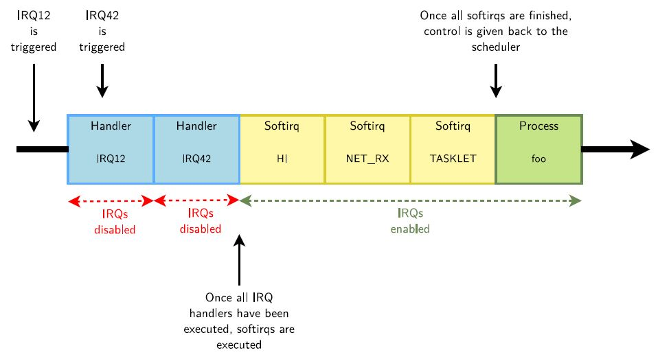
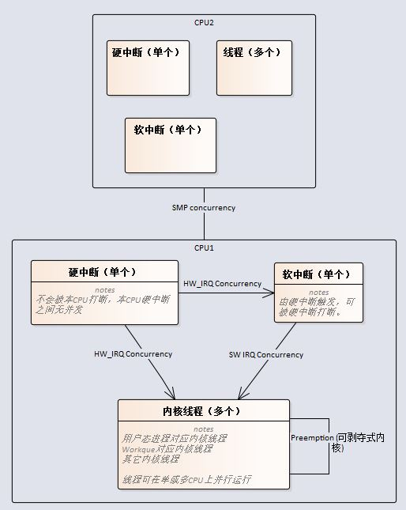
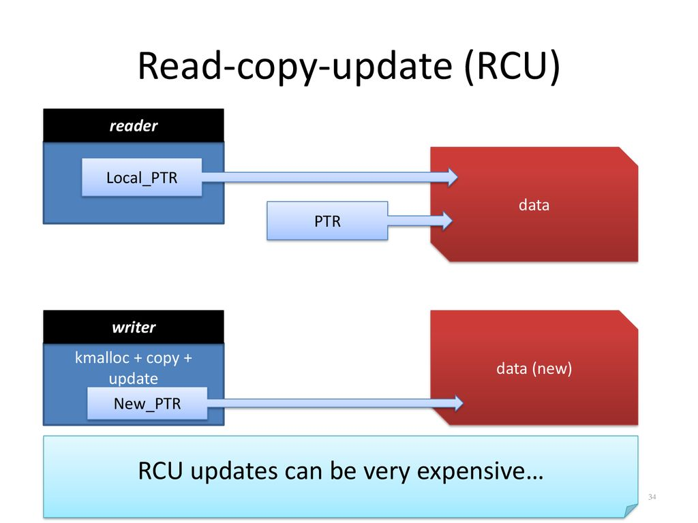
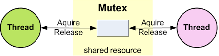

# Linux内核机制 #
## 中断处理 ##

1.硬中断首先执行，期间中断被禁止。

2.然后中断使能，软中断执行。	
>软中断有优先级，数量固定，可被硬中断打断嵌套，但不可被软中断打断，在软中断被全部处理后之前进程不会被调度。  
>
>在SMP中，软中断是谁触发，谁执行，因此多个softirq可以并行执行，甚至同一个softirq可以在多个processor上同时执行。  
>
>Linux内核最多可以支持32个softirq，但当前只实现了10个。 软中断定义在include/linux/interrupt.h，包括HI, TIMER, NET_TX, NET_RX, BLOCK, BLOCK_IOPOLL, TASKLET,SCHED, HRTIMER, RCU。

Tasklet是由链表管理的一系列延迟处理函数，分为高优先级和低优先级两个链表，分别在HI和TASKLET两个软中断中被逐个调用。

Workques是延迟处理的另一种机制，运行在内核线程，处理实时性比软件中断更低的操作。

>硬中断在Linux中被称为Top Haf, 软中断、Tasklet和Workque被称为Bottom Haf.

## 并发处理 ##
并发处理的目的是解决资源被多个使用者同时使用的冲突。  

	并发根据系统复杂度分为以下几级：
	
	1.  单CPU不可剥夺式内核  
		- 内核线程处理HW_IRQ_Concurrency和SW IRQ Concurrency的访问冲突。
		
		- 软中断处理HW_IRQ_Concurrency的访问冲突。
	
	- 单CPU可剥夺式内核   
		在上述基础增加： 
		- 内核线程处理其它内核线程的访问冲突。
	
	- 多CPU（SMP）  
		在上述基础增加：  
		- 本地CPU处理其它CPU的访问冲突。
	
	为方便移植与统一，内核API不分系统复杂度，而是本身根据配置情况进行适配。API使用者根据以下使用场景决定选择何种API。

### 在硬中断中 ###
*	Spinlock  

用于互斥访问，但效率远高于互斥锁。（锁中不能睡眠）

>	自旋锁与互斥锁有点类似，只是自旋锁不会引起调用者睡眠，如果自旋锁已经被别的执行单元保持，调用者就一直循环在那里看是否该自旋锁的保持者已经释放了锁，"自旋"一词就是因此而得名。

*	Reader/Write spinlocks  
用于多个读，单个写的场合。

>	读写锁实际是一种特殊的自旋锁，它把对共享资源的访问者划分成读者和写者，读者只对共享资源进行读访问，写者则需要对共享资源进行写操作。这种锁相对于自旋锁而言，能提高并发性，因为在多处理器系统中，它允许同时有多个读者来访问共享资源，最大可能的读者数为实际的逻辑CPU数。写者是排他性的，一个读写锁同时只能有一个写者或多个读者（与CPU数相关），但不能同时既有读者又有写者。

* seqlock  
类似读写锁，在读操作频繁且仅包括简单计算、写操作很少的情况下效率更高。
> 顺序锁(seqlock)是对读写锁的一种优化,提高了读锁和写锁的独立性。写锁不会被读锁阻塞，读锁也不会被写锁阻塞。写锁会被写锁阻塞。

> 顺序锁有一个限制:它必须要求被保护的共享资源中不能含有指针;因为写执行单元可能会使指针失效,当读执行单元如果正要访问该指针时,系统就会崩溃。

*	Atomic  

主要用于实现资源计数，很多引用计数(refcnt)就是通过原子操作实现的。
>	所谓原子操作，就是该操作绝不会在执行完毕前被任何其他任务或事件打断，也就说，它的最小的执行单位，不可能有比它更小的执行单位，因此这里的原子实际是使用了物理学里的物质微粒的概念。

>	原子操作需要硬件的支持，因此是架构相关的，其API和原子类型的定义都定义在内核源码树的include/asm/atomic.h文件中，它们都使用汇编语言实现，因为C语言并不能实现这样的操作。

*	RCU  

	对于被RCU保护的共享数据结构，读者不需要获得任何锁就可以访问它，但写者在访问它时首先拷贝一个副本，然后对副本进行修改，最后使用一个回调（callback）机制在适当的时机把指向原来数据的指针重新指向新的被修改的数据。   

	RCU保护的是指针.这一点尤其重要.因为指针赋值是一条单指令.也就是说是一个原子操作.因它更改指针指向没必要考虑它的同步.只需要考虑cache的影响。

	读者是可以嵌套的.也就是说rcu_read_lock()可以嵌套调用。

	读者在持有rcu_read_lock()的时候,不能发生进程上下文切换.否则,因为写者需要要等待读者完成,写者进程也会一直被阻塞.   

>	一般用于链表的操作。

### 在软中断中 ###
软件中断可以使用以上API，但有如下补充：

	* 自旋锁有以下扩展,以支持需要防止硬中断抢占的情况：
		* spin_lock_irqsave 禁本地中断
		* spin_lock_irq	如果明确当前中断是打开的，可以使用个函数禁止硬中断。
	* Reader/Writer Spinlocks同样，也有对应扩展。
### 在内核线程中 ###
内核线程除可以使用以上API，但需要注意以下事项：
	  
	* RCU 读操作需要在spinlock的保护下，确保进程不被调度。RCU回写回调函数不能睡眠。
	
	* 自旋锁有以下扩展,以支持需要防止软中断抢占的情况：
		* spin_lock_bh,禁止软中断。
		
	* Reader/Writer Spinlocks同样，也有对应扩展。

另外内核线程在对锁性能要求不高的情况下，应尽量使用以下通过进程调度使用锁机制的API，以减少对系统的影响：

* Mutex   

互斥锁主要用于实现内核中的互斥访问功能。

* semaphore  

相对互斥锁，信号量允许资源被多个用户计数访问的情况。

* rw_semaphore  
在读多写少的情况较semaphore高效。

>读写信号量对访问者进行了细分，或者为读者，或者为写者。写者独占临界区，排斥其他的写者和读者，而读者只排斥写者。